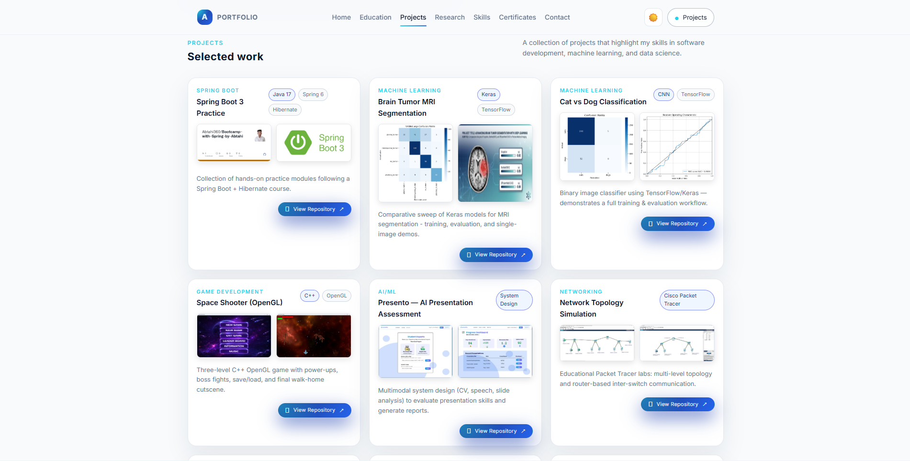
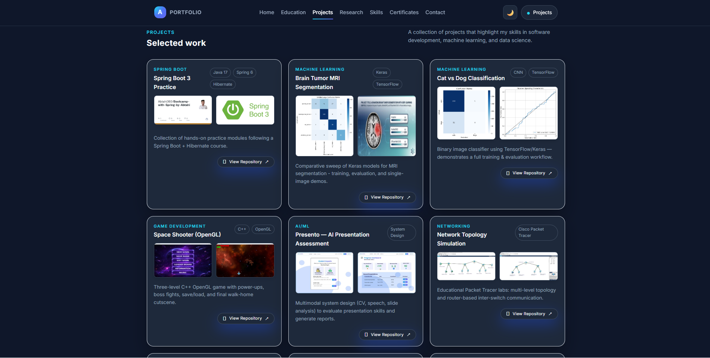
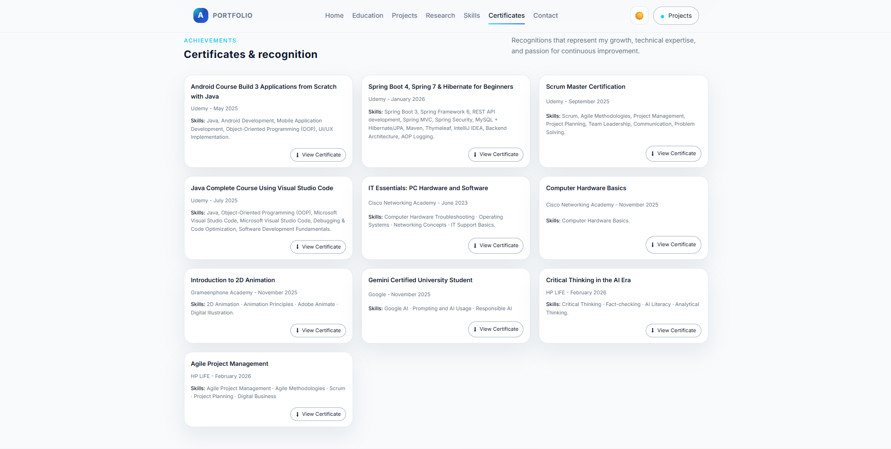
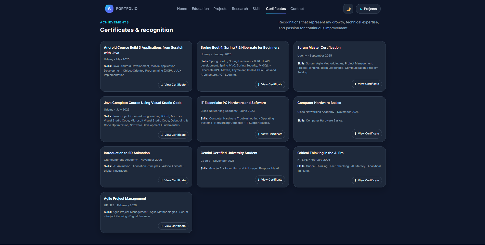

# 🌐 Personal Portfolio Website

This is my personal portfolio website built using **HTML, CSS, and JavaScript**.
It showcases my profile, projects, certifications, and resume in a simple and interactive way.

The goal of this project is to present my skills, academic work, and projects in one place.

---

## 🚀 Features

* Personal introduction section
* Project showcase with details
* Certifications and achievements
* Resume download option
* Interactive UI effects
* Custom cursor animation
* Repository view button for projects
* Responsive and clean design

---

## 🛠️ Technologies Used

* HTML5
* CSS3
* JavaScript (Vanilla JS)
* Basic Node setup (for testing)

---

## ▶️ How to Run Locally

1. Clone the repository:

```bash
git clone https://github.com/your-username/portfolio-website.git
```

2. Open the project folder:

```bash
cd portfolio-website
```

3. Open `index.html` in your browser.

✅ No build setup required.

---

## 📸 Screenshots

### 🏠 Home Page


### 💼 Projects Section




### 💼 Achievements Section




---

## 🎯 Purpose of This Project

* Practice frontend development
* Build a personal online presence
* Showcase academic and personal projects
* Improve UI design skills

---

## 📬 Contact

If you want to connect or give feedback, feel free to reach out!

---

⭐ If you like this project, consider giving it a star!
